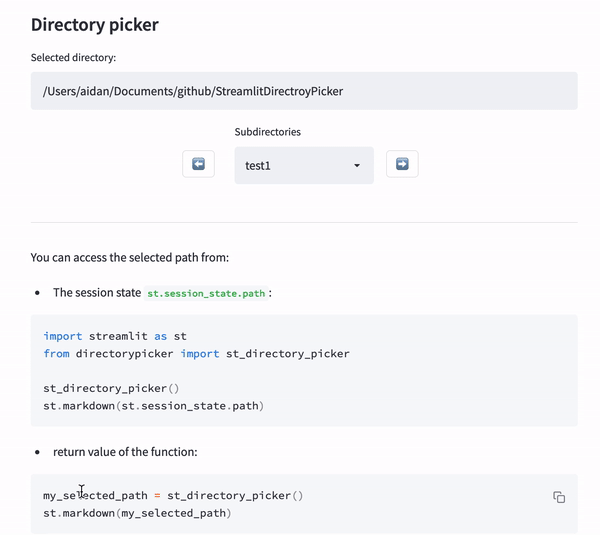

# StreamlitDirectroyPicker

Workaround to select a directory in a [Streamlit](https://streamlit.io/) app.

For now (June 2022), it is not possible to select a directory in a Streamlit app. Antother [workaround](https://github.com/streamlit/streamlit/issues/1019) exist but it required to use Tkinter. 

This workaround is only based on Streamlit elements and `pathlib`.

### Demo

